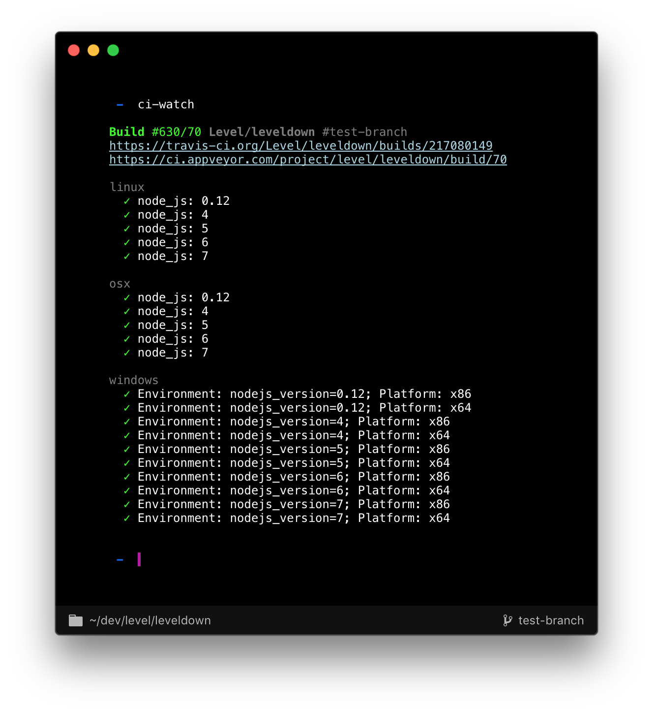

# ci-watch

Stream live CI results from multiple environments to your terminal! Exits with the proper exit code too!

Currently supports Travis and AppVeyor, so it covers macOS, Linux and Windows.



## Installation

```bash
$ npm install -g ci-watch
```

## Usage

```bash
$ ci-watch --help
Usage: ci-watch [DIRECTORY]
```

## Supported CI systems

- [Travis](https://travis-ci.org/)
- [AppVeyor](https://www.appveyor.com/)

Todo:

- [CircleCI](https://circleci.com/home/) ([#1](https://github.com/juliangruber/ci-watch/issues/1))
- [Jenkins](https://jenkins.io/) ([#2](https://github.com/juliangruber/ci-watch/issues/2))

For more, please [open an issue](https://github.com/juliangruber/ci-watch/issues/new).

## JavaScript API

```js
const differ = require('ansi-diff-stream')
const render = require('render-ci-matrix')()
const Watch = require('ci-watch')

const diff = differ()
diff.pipe(process.stdout)

const watch = new Watch(process.cwd())
watch.start()
watch.on('finish', () => {
  diff.write(render(watch.state()))
  process.exit(!watch.state.success)
})

setInterval(
  () => diff.write(render(watch.state())),
  100
)
```

## Kudos

- Development of this module is sponsored by the [Dat Project](https://datproject.org/).

## Related

- __[travis-watch](https://github.com/juliangruber/travis-watch)__ &mdash; Stream live Travis test results of the current commit to your terminal!
- __[appveyor-watch](https://github.com/juliangruber/appveyor-watch)__ &mdash; Stream live AppVeyor test results of the current commit to your terminal!
- __[ansi-diff-stream](https://github.com/mafintosh/ansi-diff-stream)__ &mdash; A transform stream that diffs input buffers and outputs the diff as ANSI. If you pipe this to a terminal it will update the output with minimal changes
- __[render-ci-matrix](https://github.com/juliangruber/render-ci-matrix)__ &mdash; Render a CI results matrix to the terminal. 

## Sponsors

This module is proudly supported by my [Sponsors](https://github.com/juliangruber/sponsors)!

Do you want to support modules like this to improve their quality, stability and weigh in on new features? Then please consider donating to my [Patreon](https://www.patreon.com/juliangruber). Not sure how much of my modules you're using? Try [feross/thanks](https://github.com/feross/thanks)!

## License

MIT
